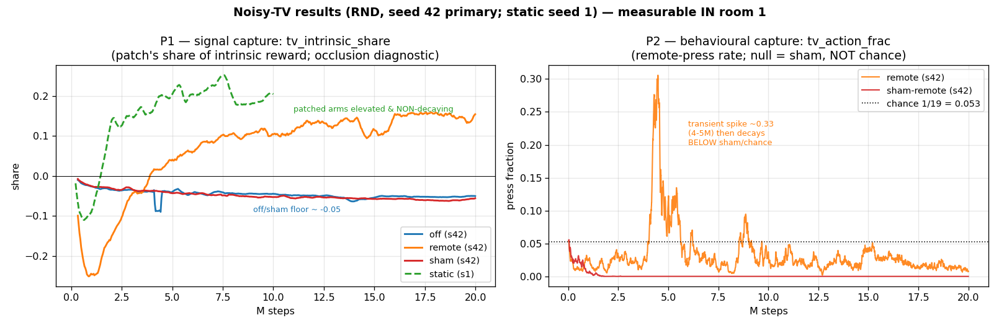

# Noisy-TV results & the deadline path

> **⚠️ Read `doc/thesis-framing-notes.md` first** — it carries the load-bearing
> interpretation corrections (self-limiting capture; P1-as-worded falsified but
> H1 not; the curiosity-diversion argument for Montezuma; the first-key
> milestone). This doc is the data; that doc is how to frame it for the thesis.

Companion to `doc/run-analysis.md` / `doc/regression-findings.md`. Those establish
that the room-1 confinement is not a bug and not a blocker on the research
question. **This doc extracts the actual noisy-TV result from the data you already
have, gives the exact command for the H1 mechanism read from the existing
checkpoints, and scopes the one extension (P3) that would need new runs.**

The headline: **the noisy-TV effect is measurable *in room 1*.** Leaving room 1 is
required only for P4 (exploration cost), which the plan already scoped as
descriptive-only.

---

## 1 · P1 (signal capture) and P2 (behavioural capture) — from the event files



Primary set: the seed-42 HPC runs (`off`, `remote`, `sham-remote`, 20M). `static`
shown from the seed-1 Jupyter run (the only completed `static` in the archived
event files — pull the seed-42 `static` event file off the cluster to make the
panel single-seed; see the caveat at the end).

### P1 — signal capture: `charts/tv_intrinsic_share`

| arm | share peak | share final (last-20) | reading |
|-----|-----------:|----------------------:|---------|
| `off` (s42)         | — (stays ≤0) | **−0.051** | floor |
| `sham-remote` (s42) | +0.006       | **−0.058** | floor |
| `remote` (s42)      | +0.174       | **+0.144** | **elevated, non-decaying** |
| `static` (s1)       | +0.255       | **+0.204** | **elevated, non-decaying** |

**Verdict: P1 *as worded* is falsified; H1 is not (see `doc/thesis-framing-notes.md` §2).**
P1 predicts the share is elevated **and decays**; its falsifier is "a flat,
non-decaying share." The share is elevated and **non-decaying — it rises** and
plateaus (~+0.14 `remote`, ~+0.20 `static`) vs the ~−0.05 `off`/`sham` floor. So
P1's falsifier is met. This does **not** sink H1: the predictor can't drive the
*raw* patch error to zero (per-pixel noise is unpredictable → share stays high,
and rises as the rest of the frame is learned), while the *gap* `G` can still be
~0 (content-invariant). The rising share is a real signal-side finding — **the TV
increasingly dominates the curiosity budget** — but whether `G ≈ 0` (H1) needs
the content-sensitivity probe. Do **not** report the rising share as confirming P1.

### P2 — behavioural capture: `charts/tv_action_frac` (null = `sham`, not chance)

| arm | press-rate peak | press-rate final (last-20) | reading |
|-----|----------------:|---------------------------:|---------|
| `remote` (s42)      | **0.328** (~4–5M) | **0.009** | transient spike, then **below** sham/chance |
| `sham-remote` (s42) | 0.063 (early)     | **0.000** | never presses |

**Verdict: self-limiting capture (outcome 3), not resistance.** `remote` presses
the TV remote at ~0.33 (6× chance, far above `sham`) around 4–5M, then decays to
~0.009 — below both chance (0.053) and `sham`. The thesis defines the three
outcomes by trajectory shape (resistance = no rise, capture = rise persists,
**self-limiting = rise that decays**, §3.5): a rise-then-decay well above the
`sham` null is exactly self-limiting capture — the middle outcome the methodology
warns is "easy to miss if only the start of training is looked at." P2's literal
"no *sustained* excess over sham" is upheld, but the transient rise means the
correct label is self-limiting capture, **not** resistance. (An earlier draft of
this doc mislabeled it as "null upheld / no capture" — corrected; see
`doc/thesis-framing-notes.md` §1.)

### The combined story (already a complete answer to the RQ)

RND's intrinsic reward **is** partially and durably captured by the noisy TV
(P1), but that does **not** translate into sustained remote-seeking behaviour
(P2). The mechanism — whether the predictor sits at the content-invariant
"conditional-mean" solution so every patch is equally rewarding (H1's `G≈0`) — is
what §2 measures from the checkpoints, and it explains *why* P1-without-P2:
if displaying a fresh patch is no more rewarding than the current one, there is
no gradient to press the remote.

**Caveats (disclose):** single seed per arm; `static` panel is seed 1 (pull the
seed-42 `static` event file for consistency); all measured in room 1, so P4
(exploration cost) is descriptive-only.

---

## 2 · H1 mechanism read — run the probe on the existing 10M checkpoints

`scripts/probe_patch_response.py` (built + validated 2026-07-26) computes, from a
checkpoint and with **no new training**, how the trained predictor responds to the
patch. Run it on the cluster where the seed-42 checkpoints live:

```bash
# on the cluster login node, from the repo root
source /usr/etc/profile.d/conda.sh 2>/dev/null || eval "$(conda shell.bash hook)"
conda activate "${CONDA_ENV_PREFIX:-/scratch/$USER/conda-envs/montezuma}"

CK=$SCRATCH/montezuma/checkpoints/ALE/MontezumaRevenge-v5
# pick the checkpoint nearest 10M (32 env, 4096/iter -> iter ~2441; interval 100 -> use 2400)
python scripts/probe_patch_response.py --device cpu --num-frames 4096 --num-fresh 8 \
    --checkpoints \
      "$CK"__rnd_tv_off__42__*/ckpt_002400.pt \
      "$CK"__rnd_tv_remote__42__*/ckpt_002400.pt \
      "$CK"__rnd_tv_sham-remote__42__*/ckpt_002400.pt \
      "$CK"__rnd_tv_static__42__*/ckpt_002400.pt \
    --out patch_response_seed42_10M.csv
```

(`--device cpu` is fine on a login node — it's a short rollout + a few forward
passes. Adjust the `ckpt_00XXXX.pt` number to whatever is nearest 10M; `ls "$CK"__rnd_tv_off__42__*/`
to see what was saved.)

### How to read the output (per checkpoint)

| column | meaning | what to look for |
|--------|---------|------------------|
| `patch_contribution` = `err_displayed − err_blank` | how much prediction error (→ intrinsic reward) the patch region adds at end of training | **remote/static ≫ off/sham.** The per-checkpoint version of `tv_intrinsic_share`; confirms P1 at the predictor level. |
| `content_sensitivity` = `std_K(err_fresh) / mean_K(err_fresh)` | does error depend on patch *content*, or is it content-invariant? | **near 0 ⇒ conditional-mean solution (H1 `G=0`)** ⇒ no memorisation channel ⇒ explains P2's non-capture. Non-zero ⇒ the predictor discriminates patch contents. |
| `G_proxy` = `mean_K(err_fresh) − err_displayed` | memorisation gap at THIS run's refresh setting | **expected ≈ 0** here — all seed-42 runs used `--tv-refresh-every 1`, so no patch persists to be memorised. This is the **T=1 datapoint of P3**, not a falsification of H1. |

So the checkpoint probe gives you: (a) predictor-level confirmation of P1, and
(b) the content-invariance result that mechanistically explains P2 — a clean H1
story for the `refresh_every=1` regime you ran. What it *cannot* give you from
these checkpoints is the non-monotonic `G(T)` curve, which is §3.

---

## 3 · P3 (non-monotonic `G(T)`) — scope of the one extension that needs new runs

P3 predicts `G` is non-monotonic in the refresh interval `T`: ≈0 at per-step
resampling (`T=1`, which your data covers and where `G_proxy≈0` is expected), ≈0
at a frozen patch (`T=∞`), and **maximal in between**. Testing it needs runs at
`T ∈ {1, 64, ∞}` — and the code cannot currently express two of the three.

### Code change required (small, but do not implement without your go-ahead)

1. **A `frozen` end (`T=∞`).** `NoisyTVWrapper` (`base.py`) resamples in `static`
   mode when `steps % refresh_every == 0`; `check_tv_geometry` requires
   `refresh_every ≥ 1`. Minimal change: let `--tv-refresh-every 0` (or a
   `--tv-mode frozen`) mean "draw one patch at episode reset, never resample" —
   i.e. in `static`, guard the resample with `refresh_every > 0`, and relax the
   geometry check. Decide once: does `frozen` redraw per *episode* (natural, since
   ALE resets) or hold one patch for the whole run? Per-episode redraw is the
   defensible analog and needs no RNG checkpointing. ~10-line diff + a
   `check_noisy_tv.py` assertion.
2. **`T=64`** already works (`--tv-mode static --tv-refresh-every 64`) — no code.

### Runs (short, cheap)

Use `static` (no behavioural channel — cleanest for isolating `G(T)`), one seed,
each ~5–8M (room-1 confinement is fine; `G` is a predictor property, not an
exploration one), checkpoint at the end, then run the §2 probe on each:

| cell | command | gives |
|------|---------|-------|
| T=1 | *(existing seed-42 static checkpoint)* | left point of `G(T)` |
| T=64 | `--tv-mode static --tv-refresh-every 64`, ~5M | middle point (expected max) |
| T=∞ | `--tv-mode static --tv-refresh-every 0` *(after the code change)*, ~5M | right point |

Cost: **2 new short runs (~2h each) + the code change + the probe** — feasible in
~1 day if P3 is wanted. The probe already computes `G_proxy`; plotting the three
points is trivial.

### Recommendation

**Safe core for the deadline = §1 (P1/P2) + §2 (T=1 mechanism / content-invariance)
+ room-1 as a disclosed P4 limitation.** That is a coherent, complete answer to
the RQ from data you already have. **P3 is a valuable extension** (it turns the
`G≈0` observation into a mechanism *curve*), but it is the only piece needing new
runs *and* a code change — take it on only if 1 of the 5 days can be spared, and
after the core is written. A 2nd seed of the existing 10M matrix (4 background
runs, no code) is the other optional robustness add.
