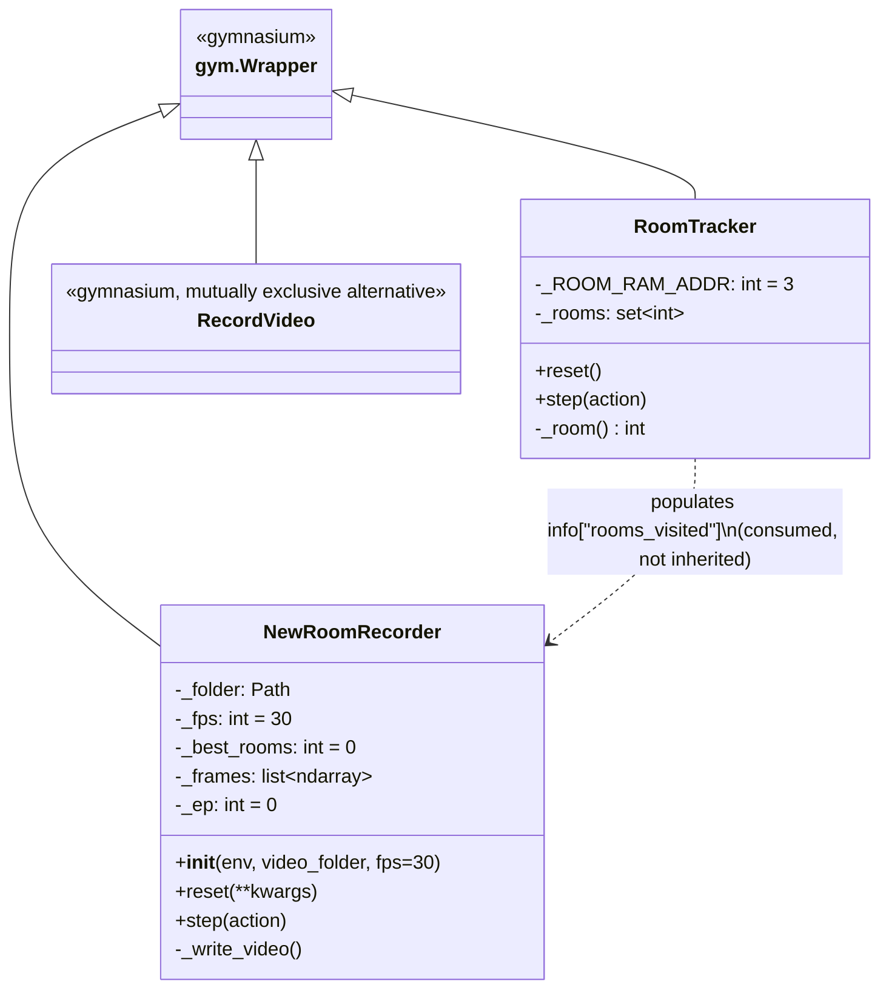

# Pipeline Development History

This document traces the development of the training pipeline for this thesis — from the
first prototype to the current multi-platform, multi-GPU setup — and explains the reasoning
behind each major decision. It is written to be checkable against the git history: every
factual claim below cites the commit hash and date it came from, and quotes commit messages
or code directly wherever possible rather than paraphrasing.

The end state (as of commit `3fee53a`, current `main` HEAD) is three CleanRL-style,
single-file agents — `ppo.py`, `count_based.py`, `rnd.py` — sharing common infrastructure in
`base.py`, runnable on three platforms: local macOS/CPU, an interactive university JupyterHub
V100 profile, and a SLURM-managed A100 HPC cluster. The algorithm roadmap (count-based → RND →
PPO) and the two headline evaluation metrics (rooms explored, mean game score) are set out in
`CLAUDE.md`; this document covers *how the code arrived at its current shape*, not the
experimental results themselves.

---

## Stage 0 — Initial AgileRL prototype (2026-05-04)

Commits: `2beb7f5` "init" → `d16ba25` "add dependencies for ppo" → `510c44d` "hyperparameters
and env".

The project started as a bare random-action script against
`gym.make("ALE/MontezumaRevenge-v5", render_mode="human")`, then pulled in
[AgileRL](https://docs.agilerl.com/) — an evolutionary-hyperparameter-optimization RL library —
importing `agilerl.algorithms.PPO` alongside a full population-based-training configuration:
`INIT_HP` (`POP_SIZE=4`, `LEARN_STEP=1024`, `GAMMA=0.99`, `TARGET_SCORE=200.0`, ...) and `MUT_P`
(mutation probabilities for architecture, learning rate, activation, etc., with
`TOURN_SIZE=2`, `ELITISM=True`).

This code was never wired up to a runnable training call (no `train_on_policy(...)` invocation
was ever added) and was deleted wholesale seven weeks later in `f6242df`. CLAUDE.md documents
the resulting decision directly: *"CleanRL is the target framework (replacing AgileRL)... AgileRL
(with evolutionary HPO) remains installed but is secondary — relevant only if evolutionary
hyperparameter search becomes part of the thesis scope later."* In other words, population-based
training was evaluated but set aside in favor of a framework that maps directly onto the
single-run comparisons the thesis needed (count-based vs. RND vs. PPO baselines against literature
benchmarks), rather than an evolutionary search across variants of each.

---

## Stage 1 — Adopting CleanRL (2026-06-11)

Commit: `670f05c` "add RND agent (PPO + Random Network Distillation)".

The first CleanRL-style file introduced was, notably, not PPO but **RND** — the algorithm of
primary interest per the thesis roadmap. The commit message states it *"Implements Burda et al.
2018 with dual critic heads (extrinsic/intrinsic), obs normalisation init phase, discounted
intrinsic reward normalisation, and update-proportion masking on the predictor — adapted from
CleanRL's ppo_rnd_envpool.py for gymnasium/macOS."* The file's own docstring cites the source
paper directly: `Reference: Burda et al., 2018 — https://arxiv.org/abs/1810.12894`.

CleanRL's single-file design (Huang et al., 2022, JMLR) was chosen because each algorithm is a
self-contained, independently readable and modifiable script — a good fit for a thesis that needs
to explain and compare exact algorithmic differences between baselines, rather than trace shared
abstractions through a general-purpose library. This is reflected directly in CLAUDE.md's
description of CleanRL as *"single-file RL implementation library — each algorithm lives in one
self-contained file, making it easy to understand, modify, and compare."*

This initial version carried a hardcoded venv guard (`sys.exit` if not run inside the project's
`.venv`) — a local-macOS-development assumption removed one week later once HPC portability
became a requirement (Stage 2).

---

## Stage 2 — Shared infrastructure and HPC groundwork (2026-06-18)

Commit: `29b4b34` "HPC migration: AsyncVectorEnv, checkpointing, SLURM scripts" (987 insertions
across 9 files — the largest single commit in the history).

This commit did three things at once:

**Extracted shared infrastructure into `src/agents/base.py`.** `NatureCNN` (the standard Nature
DQN CNN backbone), `RoomTracker` (a `gym.Wrapper` reading Atari RAM byte 3 to detect the current
room and expose `rooms_visited`), and `make_env` (the standard preprocessing stack: ALE env →
`RoomTracker` → `AtariPreprocessing` → `FrameStackObservation` → `RecordEpisodeStatistics` →
optional video recording) — so that `ppo.py`, `count_based.py`, and `rnd.py` all build environments
identically. `RoomTracker`'s room-count signal is the basis of the thesis's primary exploration
metric.

**Added the count-based baseline, `count_based.py`.** A `SimHashCounter` class implements
locality-sensitive-hash count-based exploration (average the 4-frame stack, downsample to 128
pixels, L2-normalize, project through a fixed random Gaussian matrix to a sign-bit hash, count
visits per bucket; bonus `= beta / sqrt(count)`) — the general approach of Tang et al. (2017,
*#Exploration: A Study of Count-Based Exploration for Deep Reinforcement Learning*,
[arXiv:1611.04717](https://arxiv.org/abs/1611.04717)), though the code does not cite this paper
inline (CLAUDE.md's literature-benchmark table does, listing it alongside RND and Go-Explore). The
class docstring is explicit about the *purpose* of this baseline in the thesis: it *"Demonstrates
that naive visit-counting fails on hard-exploration games: the state space is so large that nearly
every hash bucket has count=1, making the intrinsic bonus uniformly ~beta everywhere and providing
no meaningful exploration signal."* This framing — count-based exploration as a deliberately weak
baseline that motivates the need for RND's learned novelty signal — matches the roadmap ordering in
CLAUDE.md (count-based first, "baseline to demonstrate limitations on hard-exploration games").

**Laid groundwork for HPC execution.** Removed the local-venv hardcoding ("breaks on HPC"),
switched the default vectorized-env backend from `SyncVectorEnv` to `AsyncVectorEnv` "for parallel
env stepping on GPU" (keeping `--sync-envs` as an escape hatch), parametrized output directories
(`--runs-dir`, `--videos-dir`, `--checkpoint-dir`) so jobs can target cluster scratch space, added
full checkpoint save/resume to all three agents (RND additionally persists `obs_rms`, `reward_rms`,
and the reward filter state, so normalization statistics survive a preempted job being resumed),
pinned a CUDA-12.4 PyTorch `requirements.txt`, and added `slurm/setup_hpc.sh` plus per-agent
`.slurm` job scripts targeting `--partition=gpu --gres=gpu:a100:1`.

---

## Stage 3 — JupyterHub as an interactive middle ground (2026-06-18)

Four commits within under an hour: `c8de651`, `c04f1b9`, `7d6c910`, `8d4ac6c`.

Rather than moving straight to unattended SLURM batch jobs, the university's JupyterHub GPU
profile (a V100 instance) was adopted as an interactive step in between local development and full
HPC runs — useful for iterating on a GPU without the SLURM queue turnaround. This is a reasonable
methodological choice, but it introduced a genuinely different execution environment from both
"local macOS" and "SLURM/A100," which forced a rapid sequence of environment-compatibility fixes,
each solving a distinct problem surfaced only on this platform:

- **`c04f1b9`** — *"gymnasium>=1.2.0 requires Python >=3.10; JupyterHub profiles ship with Python
  3.9, so pin to 1.1.1 (latest 1.x release for 3.9)."* This is the first of two points where the
  JupyterHub and HPC dependency specs diverge: `requirements.txt`/`slurm/setup_hpc.sh` remain on
  `gymnasium==1.3.0`, while the JupyterHub notebook pins `gymnasium==1.1.1` — a split that persists
  to the current HEAD (see Cross-cutting Notes below).
- **`7d6c910`** — *"AsyncVectorEnv uses Python multiprocessing which fails inside JupyterHub
  containers with 'RuntimeError: Numpy is not available'. Add --sync-envs to the smoke test and all
  terminal run examples... Also revise --num-envs recommendation to 8 (SyncVectorEnv is
  single-threaded so more envs give diminishing returns)."* The `AsyncVectorEnv` backend adopted in
  Stage 2 specifically for GPU parallelism turned out to be incompatible with JupyterHub's
  containerized multiprocessing, forcing a platform-specific fallback to `SyncVectorEnv`.
- **`8d4ac6c`** — *"ale-py 0.11.2 was compiled against NumPy 1.x and fails with the pre-installed
  NumPy 2.0.2 on JupyterHub, causing the RuntimeError seen during environment initialization."*
  Fixed by pinning `"numpy<2"` in the JupyterHub install cell only.

**A methodological note worth naming explicitly:** `7d6c910` and `8d4ac6c` attribute the *same*
observed error string (`RuntimeError: Numpy is not available`) to two *different* root causes
(multiprocessing/`AsyncVectorEnv` vs. a NumPy-2.x/`ale-py` ABI mismatch), twelve minutes apart on
the same day. Both fixes were kept and both remain necessary at HEAD (`--sync-envs` is still
required on JupyterHub, and `numpy<2` is still pinned there). This is a real artifact of iterative,
same-error debugging under time pressure — either two distinct failures shared a similarly-worded
message, or the first fix was an incomplete diagnosis later refined — and is recorded here rather
than smoothed over, since it is a legitimate example of the debugging process a thesis methodology
section can be honest about.

**Correction (2026-07-20).** The open question above is now resolved empirically: `--sync-envs`
was the *incomplete diagnosis*. With `numpy<2` pinned, `AsyncVectorEnv` runs cleanly on JupyterHub
(verified with a 32-env async run — `Using device: cuda`, no error), so the `RuntimeError: Numpy is
not available` was purely the NumPy-2.x / `ale-py` ABI mismatch fixed in `8d4ac6c`, never a
multiprocessing limitation; `7d6c910` mis-attributed it. `--sync-envs` is therefore **not** required
on JupyterHub — it is now documented as an optional, slower single-process fallback, and CLAUDE.md +
both notebooks default to async. The platform divergence described next is correspondingly smaller:
JupyterHub can run `AsyncVectorEnv` too; only the `gymnasium`/`numpy` version pins still differ.

**Resulting platform divergence.** By the end of Stage 3, JupyterHub and HPC/SLURM run against
different pinned dependency versions (JupyterHub: `gymnasium==1.1.1`, `numpy<2`, forced
`SyncVectorEnv`; HPC: `gymnasium==1.3.0`, `numpy==2.4.4`, `AsyncVectorEnv`) — a deliberate,
platform-driven split rather than an oversight, but one that was never later reconciled into a
single dependency spec.

---

## Stage 4 — Making the JupyterHub workflow usable for real experiments (2026-06-23)

Commits: `1973da8`, `0077fa6`, `80baafb`, `8501fa9`.

- `1973da8` adds a `--video-episode-interval` flag threaded through `make_env`/`ppo.py`, and adds a
  PPO smoke-test example to the setup notebook.
- `0077fa6` adds `training-runs.ipynb` — a dedicated "quick-launch notebook for all agents,"
  deliberately separate from the one-time `jupyter-setup.ipynb` (setup vs. day-to-day launching are
  different concerns and different notebooks).
- `80baafb` backfills project documentation (`CLAUDE.md`, `doc/running-agents.md`) and packaging
  (`__init__.py` files, `.gitignore` entries for `runs/`, `videos/`, `checkpoints/`, `logs/`) —
  formalizing the project structure once it had stabilized enough to document.
- `8501fa9` fixes a JupyterHub-specific storage-persistence gotcha: *"Files outside ~/work/ are
  deleted when the server stops."* Every hardcoded path in both notebooks and CLAUDE.md moved from
  `~/montezuma` to `~/work/montezuma` accordingly, with an inline comment recording the reason:
  `# ~/work/ persists across JupyterHub restarts; ~/ does not`.

---

## Stage 5 — Gymnasium 1.x compatibility fix (2026-06-25)

Commit: `f6242df` "fix gymnasium 1.x episode logging: infos format changed in 1.0".

After a two-week gap, an attempted real training run against the now-pinned `gymnasium` versions
surfaced a compatibility break inherited from CleanRL's original code. The old pattern (present in
all three agents since Stage 1/2):

```python
if "final_info" in infos:
    for info in infos["final_info"]:
        if info is None or "episode" not in info:
            continue
        ep = info["episode"]
        ... ep["r"], ep["l"] ...
```

silently stopped working, because gymnasium 1.x removed `infos["final_info"]` (the 0.x
list-of-dicts format) in favor of a masked-array layout: episode data now lives in
`infos["episode"]["r"][i]` / `infos["episode"]["l"][i]`, masked by `infos["_episode"][i]` (true
only for envs that ended an episode on that step). The fix, applied identically to `ppo.py`,
`count_based.py`, and `rnd.py`:

```python
if "_episode" in infos:
    for i, ended in enumerate(infos["_episode"]):
        if not ended:
            continue
        r = float(infos["episode"]["r"][i])
        l = int(infos["episode"]["l"][i])
        ...
```

This had a knock-on effect on `RoomTracker`: previously, `info["rooms_visited"]` was only set
`if terminated or truncated:` (episode end only), which was fine under the old per-episode
`final_info` dicts. Under gymnasium 1.x's masked-array format, however, **every env's info dict
must carry the same keys every step** so gymnasium can stack them into arrays — so `RoomTracker`
now sets `info["rooms_visited"] = len(self._rooms)` unconditionally, every step, ensuring
`infos["rooms_visited"]` is always a valid full-length array indexable by `i` regardless of which
envs ended that step.

CLAUDE.md documents this exact gotcha (added in this commit, unchanged at HEAD) and is explicit
that it isn't a bug specific to this project: *"The old infos['final_info'] list-of-dicts pattern
from CleanRL's original code does NOT work in gymnasium 1.x."* This same commit also deleted the
now-dead Stage-0 AgileRL code (`src/init.py`, `src/main.py`, `src/recording_sample.py`,
`src/util.py`).

---

## Stage 6 — Thesis instrumentation and multi-GPU scale-out (2026-07-04)

Eleven commits in one extended session (15:23–23:34), the most decision-dense day in the
project's history, moving the pipeline from "runs correctly" to "produces the diagnostics and
scale needed for the thesis's results section."

**`c1ccbad` — thesis-grade RND logging.** Adds diagnostic TensorBoard metrics beyond what's needed
to just train the agent: raw (pre-normalization) intrinsic reward mean/std alongside the existing
normalized value (to track "curiosity signal decay" over training), `obs_rms`/`reward_rms`
standard deviations (normalizer stability), and separately-logged extrinsic/intrinsic value-head
means and losses. This reflects a shift from "does RND train" to "can the intrinsic-reward dynamics
be explained and plotted in the write-up."

**Scope narrowing to PPO vs. RND.** `b0bf944` ("simplify training-runs.ipynb: smoke test + PPO/RND
production runs only") removes the count-based agent's cells from the operational notebook, stating
directly: *"thesis focuses on PPO vs RND."* The count-based script itself (`count_based.py`) is
untouched and remains fully runnable — this was a scope reduction for the *active experimental
notebook*, not a retraction of count-based's role as the motivating negative-result baseline
established in Stage 2.

**`4119e41` — multi-GPU scale-out.** *"parallelise across 3 V100s: dual RND seeds + PPO baseline
simultaneously."* The `launch()` helper in `training-runs.ipynb` gains a `gpu=` parameter that sets
`CUDA_VISIBLE_DEVICES`, and a single notebook cell now launches RND seed 1 (GPU 0), RND seed 2
(GPU 1), and the PPO baseline (GPU 2) concurrently — two RND seeds to capture run-to-run variance
in the algorithm of primary interest, alongside one PPO baseline run. `--num-envs` is raised from 8
to 16 "given available CPU headroom" on the larger machine allocation.

**Disk-usage-driven design changes.** `48fafaf` disables checkpointing for production runs
(`--checkpoint-interval 99999`, effectively unreachable given the run lengths used) "to avoid
filling disk" — checkpoint/resume remains available for genuinely long, preemptible HPC jobs but
was judged unnecessary overhead (and disk risk) for these shorter, monitored GPU runs. `6d02c4d`
replaces RND's fixed-interval `RecordVideo` with a new `NewRoomRecorder` wrapper for the same
underlying disk-usage reason, while giving a more useful signal — see the dedicated deep dive
below.

**`3fee53a` (current `main` HEAD) — final correctness pass.** The commit message describes an
explicit verification step: *"Compared ppo.py/rnd.py against CleanRL's reference implementations
and the RND paper (Burda et al., 2018, Appendix A.3)."* Two fixes resulted:

1. **Reward clipping.** `ClipReward(env, -1, 1)` was added to `make_env`, applied *after*
   `RecordEpisodeStatistics` so the logged `episodic_return` in infos still reports the true,
   unclipped game score, while only the reward tensor the agent trains on is clipped. The docstring
   added at `base.py` explains this matches *"the original RND paper's preprocessing (Burda et al.,
   2018, Appendix A.3) and CleanRL's ppo_atari.py / ppo_rnd_envpool.py."* The concrete motivation,
   from the commit message: Montezuma's Revenge awards spiky raw rewards (e.g. torch/key pickup =
   +100, opening a door = +300) that, unclipped, were destabilizing the value loss and drowning out
   the intrinsic advantage in reward-heavy PPO updates.
2. **The RND observation-normalization buffering bug** — see the dedicated deep dive below.

Separately, `ab4715c` (23:24, on the unmerged branch `origin/worktree-update-claude-md`) brought
`CLAUDE.md` up to date with everything built since Stage 4, but this update was never merged into
`main` — see Cross-cutting Notes.

---

## Deep dive: `NewRoomRecorder`

**File:** `src/agents/base.py` (introduced in `6d02c4d`). **Type:** a `gym.Wrapper` subclass, used
only on environment index 0 of the vectorized env (the one instance constructed with
`render_mode="rgb_array"`), as an alternative to periodic `RecordVideo` sampling.



**Where it sits in the wrapper stack** (per `make_env`'s docstring): `ALE env → RoomTracker →
AtariPreprocessing → FrameStackObservation → RecordEpisodeStatistics → [ClipReward] →
[NewRoomRecorder or RecordVideo]`. It depends on `RoomTracker` having already populated
`info["rooms_visited"]`, and requires the underlying env to have been constructed with
`render_mode="rgb_array"` so `self.render()` returns real frames.

**State — persists for the entire training run, not per episode:**
- `_folder` — output directory (`{videos_dir}/{run_name}/room_discovery`), created on init.
- `_best_rooms` — the highest `rooms_visited` count seen at the end of *any* completed episode so
  far in this run. Initialized to `0` and never reset.
- `_frames` — an in-memory buffer of every rendered RGB frame of the *current* episode only.
- `_ep` — a running episode counter, used only for the output filename.

**Trigger logic (`step`):**
1. Step the wrapped env as normal; append the newly rendered frame to `_frames` (unbounded — no cap
   is applied, so very long episodes buffer proportionally more memory).
2. On episode end (`terminated or truncated`) and only if `info["rooms_visited"] > self._best_rooms`
   — a **strict** inequality, so ties do not trigger a new recording — update `_best_rooms` and call
   `_write_video()` to flush the buffered frames to disk as
   `new_room_ep{_ep:05d}_r{_best_rooms:02d}.mp4` (e.g. `new_room_ep00042_r03.mp4`, matching the
   example given in the commit message).
3. Whether or not a new high-water mark was reached, the frame buffer is cleared and `_ep` is
   incremented — episodes that don't set a new record produce no video and their frames are simply
   discarded.

**Net effect over a full run:** exactly one video per monotonically increasing room-count
milestone — e.g. the first episode ever to reach 1 room, the first to reach 2 rooms, the first to
reach 3, and so on — rather than a video every *N*th episode regardless of content. This is why RND
production runs use `--record-room-discovery` while PPO (in the same notebook) keeps the periodic
`--video-episode-interval 100` `RecordVideo` path: for RND specifically, most late-training episodes
revisit already-discovered rooms, so fixed-interval sampling would mostly capture redundant footage
and consume disk accordingly, whereas outcome-conditioned recording produces a small, information-
dense set of clips — one for each new room the agent ever reaches.

---

## Deep dive: the RND observation-normalization buffering bug

**Commit:** `3fee53a` (2026-07-04), fixed alongside the reward-clipping change described in Stage
6. Commit message: *"Also fixed rnd.py's obs-normalization init loop, which required
num_envs*num_steps append calls to flush instead of num_steps, silently dropping ~20% of the
collected init frames."*

RND runs a short random-action phase before training starts, purely to initialize the running
observation-normalization statistics (`obs_rms.mean`/`obs_rms.var`) that the intrinsic-reward
network's inputs are normalized against — controlled by `--obs-norm-init-steps` (default 50). The
loop:

```diff
     for _ in range(args.obs_norm_init_steps * args.num_steps):
         acs = envs.action_space.sample()
         next_obs_np, _, _, _, _ = envs.step(acs)
         frames_buf.append(next_obs_np[:, 3:4, :, :].astype(np.float32))  # (N, 1, 84, 84)
-        if len(frames_buf) == args.num_envs * args.num_steps:
+        if len(frames_buf) == args.num_steps:
             obs_rms.update(np.concatenate(frames_buf, axis=0))
             frames_buf = []
```

**Mechanics of the bug.** Each iteration of the outer loop steps the vectorized environment once and
appends *one array of shape `(num_envs, 1, 84, 84)`* to `frames_buf` — so `len(frames_buf)` counts
environment-steps (append calls), not individual frames; each append already contains `num_envs`
frames stacked along axis 0. The buggy flush condition compared this append-count against
`args.num_envs * args.num_steps` (e.g. with the defaults, `8 * 128 = 1024`), conflating the two
dimensions: the correct number of *appends* needed to gather one nominal "iteration" worth of data
(matching the shape of one real training-loop update) is just `args.num_steps` (`128`), since each
append already supplies the `num_envs` dimension. With the buggy threshold, `obs_rms.update()` fired
roughly `num_envs`-times less often than intended, and — per the commit's own accounting — a
fraction (~20%) of the frames collected during the whole init phase were left stranded in
`frames_buf` when the loop exited and never fed into `obs_rms.update()` at all, silently discarded.

**Why it matters.** `obs_rms`'s mean/variance directly determine the scale of every observation fed
into RND's target/predictor networks from the very first training iteration — under-populating
these statistics means the intrinsic-reward signal's normalization was calibrated from fewer,
coarser-grained samples than the `--obs-norm-init-steps` flag's documented intent
(*"Iterations of random rollouts to initialize obs running stats"*), potentially skewing the
curiosity signal's scale early in training. The fix restores the intended one-`obs_rms.update()`-
per-`num_steps`-appends cadence, so the full `obs_norm_init_steps * num_steps * num_envs` frames are
all consumed.

---

## Cross-cutting notes and known limitations

These are recorded here for transparency in the methods write-up, not as criticisms of the
process — they are the ordinary residue of an actively-iterating pipeline and are worth being
explicit about:

- **`CLAUDE.md` on `main` is stale.** The version at `main` HEAD still describes RND as "to be
  built" and does not mention `ClipReward`, `NewRoomRecorder`, `--record-room-discovery`, or
  `--sync-envs`. An updated version exists in commit `ab4715c` on the branch
  `origin/worktree-update-claude-md`, but this branch was never merged into `main`. Anyone reading
  `CLAUDE.md` alongside the current codebase should be aware of this gap; merging `ab4715c` is a
  straightforward housekeeping follow-up.
- **`doc/running-agents.md`'s performance table reflects only the original local-macOS CPU
  numbers** (~130 SPS regardless of `--num-envs`, attributed to `SyncVectorEnv` being
  single-threaded) and was never updated with JupyterHub V100 or SLURM A100 throughput figures,
  even after those platforms became the primary place training actually runs.
- **JupyterHub and HPC/SLURM use independently-pinned, unreconciled dependency versions**
  (JupyterHub: `gymnasium==1.1.1`, `numpy<2`, forced `SyncVectorEnv`; HPC:
  `requirements.txt`/`slurm/setup_hpc.sh`: `gymnasium==1.3.0`, `numpy==2.4.4`, `AsyncVectorEnv`) —
  each pin was individually justified by a platform-specific constraint (Stage 3), but the two
  specs were never unified into one, which is a reproducibility caveat worth naming explicitly if
  the thesis's methods section claims a single environment specification.

---

## Sources / References

**Algorithms implemented or used as baselines:**

- Burda, Y., Edwards, H., Storkey, A., & Klimov, O. (2018). *Exploration by Random Network
  Distillation.* [arXiv:1810.12894](https://arxiv.org/abs/1810.12894). Cited inline in
  `src/agents/rnd.py` and `src/agents/base.py` (reward-clipping preprocessing, Appendix A.3).
- Tang, H., Houthooft, R., Foote, D., Stooke, A., Chen, X., Duan, Y., Schulman, J., De Turck, F., &
  Abbeel, P. (2017). *#Exploration: A Study of Count-Based Exploration for Deep Reinforcement
  Learning.* [arXiv:1611.04717](https://arxiv.org/abs/1611.04717). Motivates the SimHash approach
  implemented in `src/agents/count_based.py`; cited in `CLAUDE.md`'s literature-benchmark table but
  not inline in the code itself.
- Ecoffet, A., Huizinga, J., Lehman, J., Stanley, K. O., & Clune, J. (2019). *Go-Explore: a New
  Approach for Hard-Exploration Problems.* [arXiv:1901.10995](https://arxiv.org/abs/1901.10995).
  Referenced in `CLAUDE.md`'s literature-benchmark table as an upper-bound comparison point, not
  implemented in this codebase.

**Tooling and infrastructure:**

- Huang, S., Dossa, R. F. J., Ye, C., Braga, J., Chakraborty, D., Mehta, K., & Araújo, J. G. M.
  (2022). *CleanRL: High-quality Single-file Implementations of Deep Reinforcement Learning
  Algorithms.* Journal of Machine Learning Research, 23(274), 1–18.
  [jmlr.org/papers/v23/21-1342.html](https://www.jmlr.org/papers/v23/21-1342.html). `ppo.py`,
  `count_based.py`, and `rnd.py` are adapted from CleanRL's `ppo_atari.py` and
  `ppo_rnd_envpool.py` ([github.com/vwxyzjn/cleanrl](https://github.com/vwxyzjn/cleanrl)).
- Towers, M., Kwiatkowski, A., Terry, J., Balis, J. U., De Cola, G., Deleu, T., Goulão, M.,
  Kallinteris, A., Krimmel, M., KG, A., Perez-Vicente, R., Pierré, A., Schulhoff, S., Tai, J. J.,
  Tan, H., & Younis, O. G. (2025). *Gymnasium: A Standard Interface for Reinforcement Learning
  Environments.* Advances in Neural Information Processing Systems /
  [arXiv:2407.17032](https://arxiv.org/abs/2407.17032). The gymnasium 1.x API migration described
  in Stage 5 is a direct consequence of this library's versioned interface changes.
- Bellemare, M. G., Naddaf, Y., Veness, J., & Bowling, M. (2013). *The Arcade Learning Environment:
  An Evaluation Platform for General Agents.* Journal of Artificial Intelligence Research, 47,
  253–279.
- Machado, M. C., Bellemare, M. G., Talvitie, E., Veness, J., Hausknecht, M., & Bowling, M. (2018).
  *Revisiting the Arcade Learning Environment: Evaluation Protocols and Open Problems for General
  Agents.* Journal of Artificial Intelligence Research, 61, 523–562. Relevant to the `make_env`
  preprocessing choices (`AtariPreprocessing` frame-skip/no-op handling, `terminal_on_life_loss`)
  that follow ALE's standard evaluation protocol.
- ALE documentation: [ale.farama.org](https://ale.farama.org/).
- AgileRL documentation: [docs.agilerl.com](https://docs.agilerl.com/) — the framework used in the
  abandoned Stage 0 prototype.
