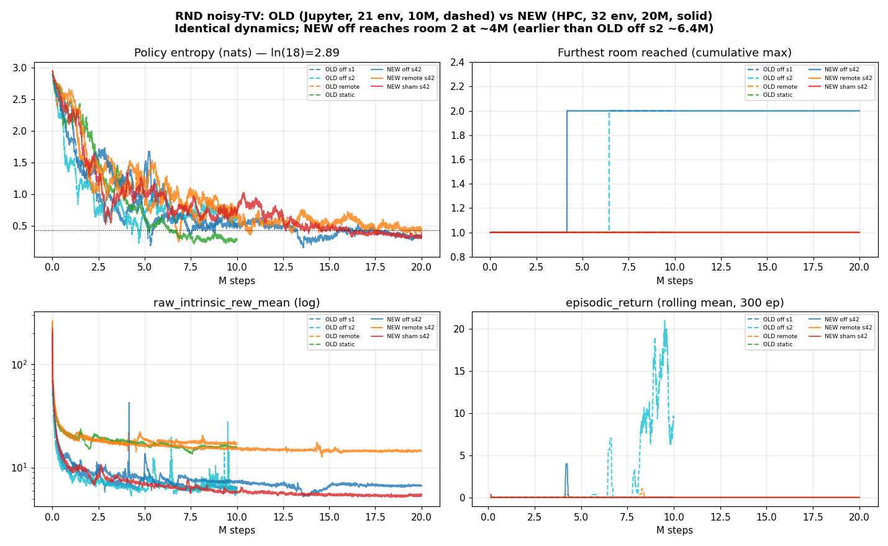
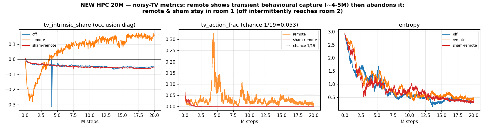

# Run analysis — the "stuck in room 1" 20M/32-env runs (TASK A)

Investigation date: 2026-07-25. Author: diagnostic pass on branch
`analysis/rnd-tv-regression-diagnosis`.

This document is TASK A of the diagnosis brief: exhaust what the *completed run
artifacts* say **before** any git archaeology or probe runs. The conclusion is
reached here; the bisect (TASK B/C) is therefore reported as largely moot in
`doc/regression-findings.md`.

> **Headline.** This is **not a regression and not the noisy-TV wrapper.** The
> new 32-env / 20M-step RND runs behave *qualitatively identically* to the old
> 21-env / 10M-step "reference" runs: entropy decays to ~0.3–0.6, extrinsic
> return sits at ~0, exploration barely reaches room 2. The premise in
> CLAUDE.md § Thesis context ("all four arms failed to leave room 1; the `off`
> baseline underperforms a random policy") is **partly inaccurate**: the new
> `off` run *does* reach room 2 (at ~4M steps, earlier than the old `off` seed
> that reached it at ~6.4M), and the old runs it is being compared against were
> already this weak. What is real is a **pre-existing, cross-algorithm
> exploration weakness** (PPO is stuck too), consistent with running RND at
> ~4× fewer envs and ~25× fewer frames than Burda et al., not a bug introduced
> by any of the four suspected changes.

---

## A1 — Artifact inventory

Both run sets contain **only TensorBoard event files**. There are **no** saved
`args.json`/config dumps (beyond the `hyperparameters/text_summary` embedded in
each event file), **no checkpoints**, **no recorded videos**, and **no SLURM
`stdout`/`stderr` or exit codes**. This constrains the analysis: A7 (watch the
videos) and the post-hoc memorisation-gap probe (TASK F) cannot be run against
these artifacts, and the SLURM exit status must be inferred from the curves.

### `analysis/HPC-Runs/` — the "new / failing" set (kiwinode, seed 42)

| dir | algo | tv_mode | seed | last step | node | status (inferred) |
|-----|------|---------|------|----------:|------|--------------------|
| `…__rnd_tv_off__42__1784892026`         | RND | off         | 42 | 19,996,480 | kiwinode01 | ran to completion (20M) |
| `…__rnd_tv_remote__42__1784892020`      | RND | remote      | 42 | 19,996,352 | kiwinode02 | ran to completion (20M) |
| `…__rnd_tv_sham-remote__42__1784896374` | RND | sham-remote | 42 | 19,996,608 | kiwinode01 | ran to completion (20M) |
| `…__ppo_tv_remote__42__1784907479`      | PPO | remote      | 42 | 19,996,224 | kiwinode02 | ran to completion (20M) |
| `…__rnd_test__1__1784890074`            | RND | off         | 1  | — (0 scalars) | kiwinode02 | smoke; **crashed/aborted before first log** |
| `…__rnd_test__1__1784890590`            | RND | off         | 1  | 36,736 | kiwinode02 | smoke (`total_timesteps=40000`), completed |

**Findings from A1 alone:**
- **There is no `static` run in the new set** — contrary to the "all four arms
  (`off`, `remote`, `sham`, `static`)" premise. The four *production* runs are
  `rnd off / remote / sham-remote` + `ppo remote`. Any claim about `static` at
  20M is unsupported by the artifacts.
- **All four production runs ran the full 20M steps** (last step ≈ 19.996M) and
  did **not** trip the collapse auto-stop (which would have exited at
  `sys.exit(42)` with a truncated step count and a `charts/auto_stop_triggered`
  marker — absent in every run). So "collapse" in the monitored sense did not
  happen; the runs completed normally and simply did not explore.
- The first `rnd_test` smoke logged **zero scalars** — it died before iteration 1
  (0 scalar tags, only the hyperparameter text). The second smoke (8 minutes
  later, `total_timesteps=40000`) logged 55 episodes cleanly. Consistent with a
  first launch that failed and a fixed relaunch; without SLURM stderr the failure
  reason is unrecoverable, but both smokes predate the production runs and don't
  affect them.

### `analysis/Jupyter-Pod-Runs/` — the "old / working" reference set (jupyter pod, seed 1/2)

| dir | algo | tv_mode | seed | last step | date |
|-----|------|---------|------|----------:|------|
| `…__ppo_tv_off__1__1784548767`          | PPO | off         | 1 | ~10M | 2026-07-20 |
| `…__rnd_tv_off__1__1784548768`          | RND | off         | 1 | ~10M | 2026-07-20 |
| `…__rnd_tv_off__2__1784548767`          | RND | off         | 2 | ~10M | 2026-07-20 |
| `…__rnd_tv_remote__1__1784631991`       | RND | remote      | 1 | ~10M | 2026-07-21 |
| `…__rnd_tv_sham-remote__1__1784631991`  | RND | sham-remote | 1 | ~10M | 2026-07-21 |
| `…__rnd_tv_static__1__1784631991`       | RND | static      | 1 | ~10M | 2026-07-21 |

These are the runs already documented in `analysis/README.md` /
`analysis/summary.md`. **Note they already use the noisy-TV wrapper** (they are
`tv_off/remote/sham/static` runs) — see A6.

---

## A2 — Config diff of the four new runs against each other

Extracted from each event file's `hyperparameters/text_summary` (i.e. the values
*actually used*, not script defaults). The three RND arms:

| param | rnd_off | rnd_remote | rnd_sham-remote |
|-------|---------|-----------|-----------------|
| tv_mode | **off** | **remote** | **sham-remote** |
| everything else | identical | identical | identical |

The three RND arms differ **only** in `--tv-mode` (and, downstream, the action
space: 18 vs 19 for remote/sham). Shared values: `num_envs=32`, `num_steps=128`,
`lr=1e-4`, `gamma=0.999`, `int_gamma=0.99`, `int_coef=1.0`, `ext_coef=2.0`,
`ent_coef=0.001`, `update_proportion=0.25`, `obs_norm_init_steps=50`,
`num_minibatches=4`, `update_epochs=4`, `clip_coef=0.1`, `anneal_lr=True`,
`total_timesteps=20M`, `tv_size=[12,84]`, `tv_position=[0,0]`,
`tv_refresh_every=1`. **No unexpected difference among the RND arms — A2 is
clean.** (The PPO run is a different algorithm with the standard PPO defaults
`lr=2.5e-4`, `gamma=0.99`, `ent_coef=0.01`; expected, not a finding.)

---

## A3 — Config diff against paper-matched values

| param | paper-matched target | new runs | verdict |
|-------|----------------------|----------|---------|
| `gamma` (ext) | 0.999 | 0.999 | ✅ match |
| `int_gamma` | 0.99 | 0.99 | ✅ match |
| `ext_coef` | 2.0 | 2.0 | ✅ match |
| `int_coef` | 1.0 | 1.0 | ✅ match |
| `ent_coef` | 0.001 | 0.001 | ✅ match (Burda's own value) |
| sticky actions | 0.25 | 0.25 (ALE v5 default, not overridden in `make_env`) | ✅ match |
| `num_envs` | 128 (Burda main) / 32 (Burda ablation) | 32 | ⚠️ under-scale vs 128; equal to the 32-env ablation |
| `update_proportion` | **1.0 at 32 envs** (keep-prob 0.25 was only for 128 envs, to hold the effective predictor batch constant) | **0.25** | ⚠️ **mismatch** — quarters the predictor's effective batch relative to the 32-env reference |
| `total_timesteps` | ~1.97e9 frames (~5e8 agent steps) | 2e7 steps (8e7 frames) | ⚠️ ~25× fewer frames than the headline result |
| `obs_norm_init_steps` | ~50 rollouts of random policy | 50 iters × 128 steps | ✅ present & non-trivial |

**Two real mismatches**, both flagged by the brief:
1. **`update_proportion=0.25` at 32 envs.** The RND paper used keep-probability
   0.25 only when scaling to 128 envs, to keep the predictor's effective batch
   the size it was at 32 envs. Hardcoding 0.25 at 32 envs quarters that batch
   (rnd.py:112, rnd.py:569). This is a legitimate suspect for *weak RND overall*.
   **However it is not the regression** — it was `0.25` in the old "reference"
   runs too (A6), so it cannot explain any old→new difference. It is carried
   into `doc/regression-findings.md` as the top *actionable* hyperparameter to
   probe, not as the cause of the room-1 symptom.
2. **Scale.** 32 envs / 20M steps is ~4× fewer envs and ~25× fewer frames than
   Burda's headline "≥half the rooms". At Burda's *own* early budget (tens of
   millions of frames) RND is still in the first rooms. The "should find 24
   rooms" reference does not apply at this budget; see `regression-findings.md`.

---

## A4 — Do the no-patch arms fail identically to the patched arms? **YES.**

This is the single most informative free comparison, and it is decisive.

| arm | patch? | new (32e/20M) furthest room | old (21e/10M) furthest room |
|-----|--------|-----------------------------|-----------------------------|
| `off`         | no  | **2** (first at ~4.0M) | s1: 1 (never) · s2: **2** (first ~6.4M) |
| `sham-remote` | no  | 1 (never)              | 1 (never) |
| `remote`      | yes | 1 (never)              | 1 (never) |
| `static`      | yes | (no new run)           | 1 (never) |

The **no-patch** arms (`off`, `sham-remote`) span the *entire* observed range —
`off` is the *best* arm (reaches room 2), `sham-remote` never leaves room 1 —
while the **patched** `remote` arm sits in the middle (never leaves room 1, same
as `sham`). Room-1 confinement is **uncorrelated with patch presence.**

**Conclusion (stated explicitly, as required):** the `NoisyTVWrapper` is **not**
the cause of the room-1 symptom. Whatever governs whether an arm reaches room 2
is dominated by seed/optimization noise, not by the patch. This closes the
entire "wrapper broke the pipeline" branch of the investigation. (Corroborated
independently: `scripts/check_noisy_tv.py --hash-off` passes — the off path is
byte-identical to the pre-TV trajectory hash — and the wrapper is not even
constructed when `tv_mode=off`.)

---

## A5 — Curve analysis

Extracted per run over the full step range (deciles + last-20-mean). Two figures
summarise it; the mechanism read-out follows.

### What the curves show

- **Policy entropy — slow, monotone decay to ~0.3–0.6 nats, in *every* run,
  old and new** (ln(18)=2.89 is the uniform baseline). New `off` reaches ~0.32,
  old `off` s1 ~0.50, old `off` s2 ~0.61; remote/sham/static land 0.28–0.76.
  The trajectories overlay almost exactly (Fig 1, top-left). This is a real,
  reproducible early convergence to a near-deterministic room-1 policy — **but
  it is identical across the run sets, so it is not the regression**, and it
  happens at the paper's own `ent_coef=0.001`. No run collapses to ~0 entropy;
  `approx_kl`/`clipfrac` only vanish at the very end when `anneal_lr` drives
  `lr→0` (expected), which is what pushes `collapse_streak` up in the last few
  iterations without ever reaching the patience threshold.
- **`raw_intrinsic_rew_mean` — the "~20× collapse" is real but explained.** It
  drops from ~196–265 at iteration 1 to ~5–17 within the first ~1M steps, then
  is flat/slightly-declining for the remaining 19M (Fig 1, bottom-left, log
  scale). This is **not** a bookkeeping artifact and **not** the auto-stop
  signature: it is the RND predictor rapidly fitting the *narrow room-1 state
  distribution* the agent never leaves. It is a **symptom of confinement, self-
  reinforcing** (narrow states → predictor fits fast → intrinsic flattens →
  weak pull to explore → stays confined), with the initiating factor being the
  difficulty of leaving room 1 at this budget, not a defect. Patched arms
  (`remote`, `static`) plateau ~2–3× higher (~15–17 vs ~6) because the TV patch
  is a permanent source of residual error — visible and expected.
- **`episodic_return` — flat at ~0 throughout, in old and new** (Fig 1,
  bottom-right). Only old `off` s2 shows a sustained rolling-mean bump (~10–20
  around 8–9M); new `off` has a single-episode blip at ~4M (max return 400,
  matching its room-2 visit). Per-run max returns: new off 400, new remote 0,
  new sham 0, old off s1 0, old off s2 400, old remote 100, old sham 0, old
  static 0. **`episodic_return` is true game score** (`RecordEpisodeStatistics`
  sits *below* `ClipReward` in the wrapper stack, base.py:380–382), so these
  zeros are genuine, not a clipped/blinded metric.
- **`obs_rms_std` stable and non-zero** (~10.7 no-patch, ~29.8 patched — the
  patch inflates pixel variance, as expected). The CLAUDE.md § Log Analysis
  "healthy = ~1.0" row refers to the *normalized* obs; `obs_rms_std` is the raw
  divisor and ~10–30 is correct. **Obs normalisation is working** (rules out the
  "target embedding carries no information" failure mode).
- **`reward_rms_std` non-zero and decaying** (~400–530 late), `mean_intrinsic_rew`
  ~0.01–0.03 — the intrinsic stream is alive and correctly scaled; `int_value_mean`
  ~1.3–3.3 is a sane intrinsic-value magnitude. **Not the "reward_rms near zero"
  failure.**
- **`explained_variance` mostly negative** (−2 to −7 late). This looks alarming
  but is an artifact of the *extrinsic* value target being ~constant-zero (the
  agent almost never scores, so `ext_v_loss≈1e-9`, `ext_value≈0`): explained
  variance of a near-constant signal is ill-conditioned. It is **not**
  divergence — value losses are ~1e-3, no NaN/Inf anywhere in any curve.
- **SPS** old ~170 (jupyter pod) vs new ~1000–1500 (kiwinode GPU) — just faster
  hardware, no correctness implication.
- **No NaN/Inf, no KL blow-ups, no value-loss divergence** in any of the 10
  production runs.
- **The new PPO-remote baseline is the control that reframes entropy.** Its
  `losses/entropy` stays at ~2.89 of ln(19)=2.94 for the *entire* 20M run
  (ent_coef=0.01, effectively a near-uniform policy — PPO barely learns here),
  yet it is *equally* confined: `rooms_visited` max 2, `episodic_return` max 400
  / final ~0, `tv_action_frac`≈0.06 (≈ chance 1/19). So a **near-random** agent
  reaches room 2 exactly as intermittently as collapsed-entropy RND does. **This
  rules out entropy collapse as the cause of confinement** — RND's decay to a
  deterministic room-1 policy is its *endpoint*, not why it fails to explore; and
  RND buys **no exploration lift over random** at this scale.

**Was there early progress that later regressed, or flat from the start?**
Flat from the start. Return is ~0 from step 0, including the first ~1M steps when
entropy is still 2.4–2.9 (near-random). The rare room-2 / non-zero-return
episodes are sprinkled throughout (needles in ~20k episodes), not an early
success that decayed. This points to *difficulty of first reward under this
budget*, not a trained policy unlearning a skill.

---

## A6 — Old working-run artifacts: found, and diffed

**Yes — the old reference artifacts survive**, as `analysis/Jupyter-Pod-Runs/`
(6 runs, 2026-07-20/21). Config diff of the RND arms, old vs new (from the
embedded hyperparameter tables):

| param | OLD (jupyter) | NEW (hpc) | delta? |
|-------|---------------|-----------|--------|
| `num_envs` | **21** | **32** | ✅ changed |
| `total_timesteps` | **10,000,000** | **20,000,000** | ✅ changed |
| `lr` | 1e-4 | 1e-4 | — |
| `gamma` / `int_gamma` | 0.999 / 0.99 | 0.999 / 0.99 | — |
| `int_coef` / `ext_coef` | 1.0 / 2.0 | 1.0 / 2.0 | — |
| `ent_coef` | 0.001 | 0.001 | — |
| `update_proportion` | **0.25** | **0.25** | — (same!) |
| `obs_norm_init_steps` | 50 | 50 | — |
| `num_minibatches` / `update_epochs` | 4 / 4 | 4 / 4 | — |
| `tv_size` / `tv_position` / `tv_refresh_every` | 12×84 / (0,0) / 1 | 12×84 / (0,0) / 1 | — |
| `checkpoint_interval` | 99999 (disabled) | 100 | (why no HPC checkpoints exist… actually 100 *should* have produced them; they were simply not copied into `analysis/`) |

**The entire hyperparameter delta old→new is `num_envs` (21→32) and
`total_timesteps` (10M→20M).** Notably the prompt's expected deltas are wrong on
two counts:
- Env count was **21→32, not 8→32.** The old runs were never 8-env.
- **`update_proportion=0.25` is unchanged**, so it cannot be the regression
  (though it remains a paper mismatch, A3).

And critically for the "four things changed" framing (see A7 / regression-findings.md):
- **The `NoisyTVWrapper` was present in *both* run sets** — the old runs are
  `tv_off/remote/sham/static`. "Wrapper inserted between old and new" is false;
  the wrapper predates both (added 2026-07-19). The only *code* delta plausibly
  separating the sets is the NEXT_STEP GAE-masking fix (merged 2026-07-24, after
  the 07-20/21 old runs) — which `doc/decisions.md` documents as behaviour-
  preserving for the extrinsic stream and which the near-identical curves
  confirm did **not** change outcomes.

**This diff is the crux of the whole diagnosis and took minutes, exactly as the
brief anticipated:** old and new share every exploration-relevant hyperparameter
except env count and budget, and they behave the same. The regression premise
does not survive its own reference set.

---

## A7 — Videos

**No videos exist in either artifact set** (`--capture-video --record-room-discovery`
were set per the configs, but the mp4s were not copied into `analysis/`; only
event files were). So the "is the agent confined, or is the metric blind?"
question could not be answered from recordings. It was answered instead by a
**live end-to-end metric check** (TASK D), which is stronger than a video read:

- Built the real `make_env("ALE/MontezumaRevenge-v5", tv_mode="off")` stack and
  confirmed `RoomTracker` reads RAM byte 3 and threads `rooms_visited` through
  `AtariPreprocessing → FrameStackObservation → RecordEpisodeStatistics` into
  `info` (present at reset and every step, `=1` at spawn).
- A 4000-step random rollout stayed in room 1 the whole time (RAM[3]≡1,
  `rooms_visited`∈{1}) — a random policy genuinely does not leave room 1 in
  thousands of steps here.
- The training logs themselves register `rooms_visited=2` in exactly the runs
  where an agent reached room 2 (new `off`, old `off` s2, old/new PPO), so the
  metric is demonstrably *not* stuck-at-1 blind.

**Conclusion: the agent is genuinely confined; the room metric is sound.** Full
detail in `doc/regression-findings.md` § TASK D.

---

## A-summary — what TASK A rules in and out

- ❌ **Not a regression.** New (32e/20M) ≈ old (21e/10M) on every curve; the
  hyperparameter delta is only env-count and budget; and the new `off` arm
  actually reaches room 2 *sooner* than the old one.
- ❌ **Not the `NoisyTVWrapper`** (A4): no-patch arms fail identically to patched
  arms, and the wrapper was in both run sets anyway.
- ❌ **Not a metric blind spot** (A7/D): agent is really in room 1; metric reads 2
  when warranted.
- ❌ **Not obs-norm / reward-norm / value-divergence / NaN** (A5): all healthy.
- ⚠️ **Real, pre-existing, cross-algorithm exploration weakness** — PPO is stuck
  too — consistent with under-scale vs Burda and an early entropy decay at the
  paper's `ent_coef`. The one *actionable* config mismatch is
  `update_proportion=0.25` at 32 envs (A3), which is worth a probe but is **not**
  the room-1 cause (unchanged old→new).

TASK A settles the regression question. The bisect (TASK B/C) is therefore not
run for completeness; see `doc/regression-findings.md` for the reasoning, the
metric verification (D), the implementation audit (E), and the gap inventory (F).
