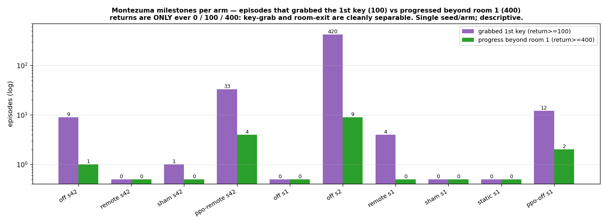

# ⚠️ IMPORTANT — framing realizations for the thesis (Results & Discussion)

**Read this before writing chapters 4 (Results) and 5 (Discussion).** These are
interpretation decisions and corrections that came out of re-reading
`chapter/01_Introduction.tex` + `chapter/03_Methodology.tex` against the actual
run data (`analysis/HPC-Runs` seed 42, `analysis/Jupyter-Pod-Runs` seed 1/2).
Everything here is checked against the thesis's *own* definitions (§ references
are to `03_Methodology.tex`). Companion data doc: `doc/noisy-tv-results.md`.

**⚠️ Framing principle (Timo, 2026-07-27 — governs everything below):** the
research question and P1–P4 stay **as originally worded** in the methodology. Do
**not** adapt the questions to what the data happened to support. This is a
bachelor thesis — an introduction to scientific practice — and a question that
turns out to be only partly answerable, for stated resource reasons, is a fine
outcome; what is graded is that the write-up shows the student knows what he is
doing. Concretely: ask the question as planned → report what the data says,
**including falsifications** → explain the mechanism in the Discussion (e.g. the
Burda §2.2.1 factor reading: factor 2 eliminated at the deterministic target, the
attack re-routed through factor 1 / factor 4 — interpretation, not a rewritten
question) → disclose what could not be answered and why (scale limit for
exploration cost; missing `frozen` mode for P3; n=1–3 seeds). Pre-registered
falsifiers that fire, and partial answers with honest causes, are *evidence of
competence*, not defects to reword away.

Four things are load-bearing and easy to get wrong:

---

## ⚠️ 1. The result is **self-limiting capture** (outcome 3), NOT resistance

The methodology (`\label{HypothesisH1}`, §3.5) defines exactly three outcomes by
the **shape of the `tv_action_frac` trajectory**:

- **resistance** — no rise
- **sustained capture** — rise that persists
- **self-limiting capture** — *rise that decays* ("frequent remote presses raise
  the effective refresh rate toward the per-step regime, which closes `G`, which
  removes the incentive to press")

The data is the **third** case. In `remote`, `tv_action_frac` **rises to ~0.33
around 4–5M steps, then decays** to ~0.01 — and this reproduces in *both* remote
seeds (seed 42: 0.33→0.009; Jupyter seed 1: 0.23→0.010). `sham-remote` never
rises (stays ~0). A transient rise that decays, well above the `sham` null, is
the textbook self-limiting signature.

> **Correction of an earlier analysis note:** an intermediate draft described P2
> as "no sustained excess over sham → null upheld," which reads as *resistance*
> (outcome 1). That collapses three outcomes into two. The correct reading is
> **self-limiting capture** — arguably the more interesting result, and the one
> the methodology explicitly warns is "easy to miss if only the start of training
> is looked at."

**To claim it as *demonstrated* rather than *inferred*:** the self-limiting story
is a trajectory claim (the memorisation gap `G` open early → closed late). The
end-of-training checkpoint alone can't show that. Run `probe_patch_response.py`
on an **early (~4–5M, during the spike)** and a **late (~10M)** `remote`
checkpoint and compare `content_sensitivity`/`G`: higher early, lower late =
mechanism demonstrated. (This is the "early/late probe" in the TODOs.)

---

## ⚠️ 2. P1 as *worded* is FALSIFIED by the data — but H1 is not

P1 (§3.5) states: *"`tv_intrinsic_share` is elevated early **and decays over
training** as the predictor generalises over the patch. Falsifier: a flat,
non-decaying share."*

**The data meets P1's falsifier.** `tv_intrinsic_share` is elevated **and does
not decay — it *rises* and plateaus**: `remote` climbs to ~+0.14, `static` to
~+0.20, both flat/rising to the end, vs the ~−0.05 `off`/`sham` artifact floor.
So the literal prediction "the share decays" is not what happened.

**This does not sink H1 — it exposes that P1 conflates two senses of "generalise":**
1. *Drive the raw patch error to zero* (learn to predict the noise). The predictor
   **cannot** do this — per-pixel white noise is unpredictable — so the patch
   remains a persistent error source and the share stays high. As the predictor
   learns the *rest* of the frame (room 1), the patch becomes a **larger share**
   of the shrinking remaining error → the share *rises*. That is itself a
   signal-side finding: **the TV increasingly dominates the curiosity budget.**
2. *Become content-invariant* (the conditional-mean solution, §3.4 `CondMean`):
   give the same error to any patch content, so `G = err(fresh) − err(displayed)
   → 0`. The predictor **can** do this, and it is what H1's capture criterion
   (`G > 0` sustained) actually hinges on.

The occlusion share (P1) measures sense 1; the memorisation gap (H1) measures
sense 2. **The data can falsify P1 while supporting H1** — a rising share (can't
zero the noise) *with* `G ≈ 0` (content-invariant) is exactly what produces
self-limiting capture: persistent signal, no exploitable gap.

**Action for the thesis (your call, LaTeX):** either (a) reword P1 so its
falsifier is about the *gap* (content-sensitivity), not the raw occlusion share,
or (b) keep P1 and report the non-decaying share as a *falsification-with-
refinement* — "the raw share does not decay (P1 falsified as stated), but the
content-sensitivity probe shows the gap is closed, which is the mechanism P1 was
proxying for." **Do not report the rising share as if it confirmed P1.**

**Decision (2026-07-27): option (b).** Per the framing principle at the top of
this doc, P1 stays as originally worded — rewording a prediction after seeing the
data is exactly the retrofitting the principle rules out. Report it
falsified-as-stated, then give the two-senses-of-"generalise" refinement in the
Discussion.

**Blocker for settling this:** whether `G ≈ 0` is real (content-invariant) or the
predictor genuinely isn't generalising must be decided by the **content-sensitivity
probe** (`probe_patch_response.py`). Until that runs, this stays "P1 falsified;
H1 pending the gap probe." Note the thesis already flags the direct
`tv_memorisation_gap` probe as **[TODO, unimplemented]** — the probe script now
exists (`scripts/probe_patch_response.py`); it just needs to be run on the
cluster checkpoints.

---

## ⚠️ 3. Keeping Montezuma central — the curiosity-diversion argument (for Discussion)

**The concern (valid):** the H1 *mechanism* — predictor generalises over a noise
patch — is environment-agnostic. With the agent stuck in room 1, Montezuma risks
reading as mere wallpaper behind the TV. The research question and contribution,
though, are Montezuma-specific *by construction* (§3.1: "Montezuma's Revenge is
the game RND was built to solve, so it is where the immunity claim is worth
testing cleanly").

**The defensible framing that keeps Montezuma essential *without* needing the
agent to explore far:** reframe the occlusion result (P1) as **curiosity
diversion**. In Montezuma the extrinsic reward is all zeros until the first key
(Background §`ExplorationProblem`: the first reward "requires a specific sequence
of jumps and a ladder climb before any points appear"), so **until that first
key, intrinsic reward is effectively the agent's only compass toward it.** A TV
that captures a *persistent, non-decaying, ~14–20% (and rising) share* of that
intrinsic reward is therefore diverting exactly the signal the agent depends on
to make its first progress — in the one game where that dependence is maximal.
That is *why* a noisy TV is dangerous here specifically and not in a dense-reward
game.

Precise wording that survives scrutiny (both reward streams stay live per §3.1,
`c_ext=2.0`, `c_int=1.0` — so do **not** say the experiment turns extrinsic off):

> *"Before the first key, the extrinsic stream is all zeros; intrinsic reward is
> the agent's only compass toward that first reward. The noisy TV is measured to
> capture a persistent, non-decaying share of exactly that signal."*

**Is "a difference in curiosity points toward better/worse handling" the argument?**
Refined: the clean, defensible claim is about how curiosity is **allocated** (TV
region vs game content) — that is the *mechanism* by which the TV would impair
exploration. The downstream *gameplay* consequence we can only observe partially
(key-grabs, rare room-2, §4 below) and must report **descriptively** — resources
limited our ability to see the full behavioural effect. So: *allocation is the
clean result; gameplay consequence is the resource-limited descriptive layer.*

**Honest scope limit (state it):** we cannot claim "the TV stops the agent
solving Montezuma," because the `off` baseline does not solve it either at this
budget. The claim is a *quantified, persistent diversion of the curiosity budget*
plus its *mechanism (self-limiting via a closing gap)* — not a demonstrated
behavioural collapse.

---

## ⚠️ 4. The first-key milestone (Timo's idea) — a finer, Montezuma-specific exploration read

**Motivation:** binary "left room 1" is too coarse and too noisy to carry a
result here. "Grabbed the first key" is a milestone the agent can plausibly reach
without full backtracking, and it is a genuinely Montezuma-specific behaviour.
**It is derivable from the already-logged `episodic_return`** (no new metric) —
so it fits P4's descriptive-only framing.

**Scoring structure (verified empirically):** across every run, the *only*
non-zero returns that ever occur are **exactly 100 and 400** — never 200/300. So:
- **return = 100** → grabbed the first key, still in room 1;
- **return = 400** → key **plus** progress beyond room 1 (the +300 requires
  leaving);
- the two milestones are **cleanly separable**, and "grab the key" is strictly
  the easier one.

Episodes reaching each milestone (single seed per arm — **descriptive only**):

| arm (seed, config) | grabbed key (≥100) | progress (≥400) | room≥2 eps | first key @ |
|---|---:|---:|---:|---|
| rnd `off` s2 (Jup) | **420** | 9 | 6 | ~5.5M |
| ppo `remote` s42 | 33 | 4 | 2 | ~0.3M |
| ppo `off` s1 (Jup) | 12 | 2 | 2 | ~0.78M |
| rnd `off` s42 | 9 | 1 | 1 | ~4.1M |
| rnd `remote` s1 (Jup) | 4 | 0 | 0 | ~4.1M |
| rnd `sham` s42 | 1 | 0 | 0 | ~0.05M |
| rnd `off` s1 (Jup) | 0 | 0 | 0 | — |
| rnd `remote` s42 | **0** | 0 | 0 | — |
| rnd `sham` s1 (Jup) | 0 | 0 | 0 | — |
| rnd `static` s1 (Jup) | 0 | 0 | 0 | — |

**What it shows (all descriptive, single-seed, read with the confounds below):**
1. **The first key IS learnable by RND** — `rnd off` seed 2 grabbed it **420
   times**, onset ~5.5M. So "grab the key" is a real, reachable milestone, not a
   fluke. (Your instinct to treat it as a big step is right.)
2. **Backtracking to leave is the bottleneck, not grabbing the key** — key-grabs
   ≫ progress everywhere (off s2: 411×100 vs 9×400; ppo-remote: 29×100 vs 4×400).
   This directly supports your hypothesis that the agent can reach the key but
   mostly cannot convert it into leaving the room (likely under-trained
   backtracking). Report this explicitly.
3. **Only the no-TV, 18-action baseline (`off` s2) ever *learned* the key**;
   every TV / extra-action arm (`remote`, `sham`, `static`) reached it 0–4 times.
   Suggestive that the patch and/or the added action impair first-key learning.
4. **PPO grabs the key more than most RND arms** (ppo-remote 33 vs rnd-remote 0)
   because PPO keeps a near-uniform (high-entropy) policy and keeps stumbling,
   while RND's entropy collapses and it stops trying. Worth a sentence in
   Discussion; ties to the pre-existing "RND underperforms PPO at this scale"
   thread.

**Confounds / caveats (must accompany the above):** one seed per arm (except
`off`); `off` itself is 0 in seed 1 and 420 in seed 2 (huge seed variance); the
"TV arms never learn the key" signal is confounded — `sham` (no patch, +1 action)
also fails, so it cannot be cleanly attributed to the TV vs the action-space
change. **Budget mismatch:** the table mixes 10M Jupyter runs (seed 1/2) with 20M
HPC runs (seed 42), and a 20M run has ~2× the episodes in which to stumble on a
key, so raw *counts* are not comparable across the two sets. The striking case is
`rnd off` s2 (Jupyter, **10M**) with **420** grabs vs `rnd off` s42 (HPC, **20M**)
with only **9** — the shorter run scored far more, so this is seed variance, not a
budget effect. The only apples-to-apples slice is the seed-42 HPC set (all 20M, one
config): `off` 9, `remote` 0, `sham` 1 — still n=1 and still swamped by the 0-vs-420
seed swing. A fairer cross-budget comparison would normalise to a *rate* (grabs per
episode or per M steps) rather than a raw count. So this is a **descriptive**
finding (P4), consistent with the TV and/or the added action impairing first-key
learning, *not* an inferential claim.

---

## ⚠️ Compute limitation — the per-run 32-env ceiling (why the paper's 128-env scale regime is out of reach)

The room-1 confinement is a **scale** limit (§3): the paper's regime is ~128
parallel envs run for ~2 B frames; our runs use 32 envs. This subsection records
*why 128 envs is not reachable per run on the available hardware* — so the scale
limit is a genuine compute-envelope constraint, not a budget preference.

**The cluster (HTW KI-Werkstatt `kiwihead01`, verified 2026-07-27).** One partition
(`Debug_node`), two nodes (`kiwinode01`, `kiwinode02`), each **128 physical CPU
cores (`CoresPerSocket=32`) + 4 GPUs + ~1 TB RAM** → **32 cores per GPU** (128 ÷ 4).
`AsyncVectorEnv` spawns one process per env and wants ~one core each, so the natural
per-GPU allotment is **32 envs** — exactly the value every run uses.

**Getting 128 *dedicated* cores for one run is possible but rejected.** There is no
scheduler policy cap (`MaxCPUsPerNode=UNLIMITED`; the account/QOS carry no
`GrpTRES`/`MaxTRES` limits), and `sbatch --test-only --gres=gpu:1 --cpus-per-task=128`
confirmed the scheduler *would* place 128 processors on one node. But a 1-GPU job
claiming all 128 cores **monopolises an entire node while using only 1 of its 4
GPUs, stranding the other 3** (no cores remain to pair with them). Dedicating a
whole node — and idling 3 of 4 GPUs — to a single run is not acceptable and is
deliberately not done. The only single-GPU alternative, 128 envs oversubscribed onto
32 cores (4×), is not a real scale increase: it time-shares the same cores, so
throughput and exploratory coverage do not grow — it is just a slower
32-env-equivalent.

**Training cannot be parallelised across a node's 4 GPUs without a rewrite.** The
agents are single-file, single-GPU (CleanRL-style: one process, one `device="cuda"`,
one optimizer). Making *one* run use all 4 GPUs would need `DistributedDataParallel`
(or torch multiprocessing) + sharding the envs across GPUs + synchronising the RND
obs/reward normalisation statistics across replicas — substantial new code with real
correctness traps, out of scope for a characterisation-only thesis. (Parallelism
*across runs* is free and is how the matrix already runs — 4 independent 32-env jobs
fill a node's 4 GPUs — but parallelism *within* a run is unavailable.)

**Consequence.** The practical ceiling is **32 envs per run**. Reaching the paper's
128-env regime would require either monopolising a node (wasting 3 GPUs) or a
multi-GPU reimplementation — neither taken. This is the concrete reason the room-1
scale limit (§3) is *reported as a limitation rather than engineered around*: the
compute envelope, not merely a budget choice, blocks the 128-env regime.

---

## ⚠️ Closest prior work — Jarrett et al., "Curiosity in Hindsight" (ICML 2023) — verified positioning

Full paper read 2026-07-27 (arXiv 2211.10515v2; Jarrett, Tallec, Altché, Mesnard,
Munos, Valko; DeepMind). **This must be cited prominently in Related Work — it is
the closest prior work, and it *strengthens* the thesis's motivation.** Verified
facts (with locations), then the honest differentiation.

### What they did (verified against the PDF)

- **Pycolab maze, 4 stochasticity settings** (§5.1, Fig 6; 100k learner steps, 3
  seeds, 500-step episodes; trackers R1–R4 behind oscillating blocks; 5×5 obs):
  - *No noise:* "All algorithms reach all four trackers (with RND eventually
    losing interest due to vanished rewards, as the environment is small)."
    Appendix B.8 has a dedicated RND paragraph: RND "is simply learning a mapping
    from x_{t+1} to f_random(x_{t+1})... it much more quickly 'loses interest'
    due to vanished rewards" — a **vanishing-rewards** account, not a noise failure.
  - *Brownian oscillators (state-dependent):* "BYOL-Hindsight and RND both still
    explore the entire maze"; RND shown "in principle resilient to noise, as its
    targets are deterministic." → The deterministic-target firewall **holds** for
    structured state-dependent noise.
  - *Random pixel noise (iid, p=0.25/frame, full extra layer):* "both BYOL-Explore
    and RND do worse as the noise is an entire layer of random pixels (i.e.
    extremely diffuse), which outcompetes all other dynamics of the world in
    magnitude."
  - *On-demand pixel noise:* triggered "**whenever the no-op action is selected**"
    — a NOOP-triggered noise channel, structurally the same trigger idea as our
    `remote` (!). Result: "Even RND suffers greatly, which makes sense because
    the agent is no longer guaranteed a 0.75 probability of observing the world's
    unpolluted dynamics." That is their **entire** RND analysis of this case — a
    *dilution* explanation, one clause, no action statistics, no seeking measure.
- **Atari:** Bank Heist (natural traps + sticky actions, §5.2), **Montezuma with
  sticky actions 0.1** + non-sticky baseline (§5.3), 10 hard-exploration games
  (§5.4), and — important — **"Persistive Noise" on Montezuma** (§5.5 + App. B.2):
  an **additive full-frame 84×84 noise layer, per-pixel random walk** (mod-50 on
  top of the observation), step size ±1 or ±11 depending on the **parity of the
  previous action's key code** — i.e. action-dependent AND persistent. Their
  design rationale: prior pixel noise was non-additive or non-persistent, so a
  representation could "simply 'ignore' the noise. This is not possible in our
  setting." **RND appears in the persistive-noise figures (11–12) but the B.2
  text analyzes only BYOL-Explore vs BYOL-Hindsight** ("BYOL-Explore suffers
  greatly..., BYOL-Hindsight is more resilient") — not one sentence on RND.
- **How RND is treated throughout:** a reference baseline ("implemented exactly
  as described in [BYOL-Explore]"), 3M learner steps, 3 seeds, VMPO harness with
  **400 CPU actors + 4 TPUv2 per run** (App. C.3). Their theory-level account of
  RND-under-noise is §2.2 pt. 2 + Table 1: deterministic-input methods are "in
  principle resilient to stochasticity. But empirically they can still behave
  poorly in the presence of action-dependent stochasticities: If the noise is
  sufficiently diffuse, the agent may never learn the function well... they may
  still become stuck."

### What they did NOT do (the thesis's space, verified absent)

1. **RND is never the object of study** — no experiment or analysis section is
   about RND; every RND result is a curve plus at most one explanatory clause.
2. **No capture-channel decomposition.** They measure aggregate exploration
   (trackers / rooms / returns) only. No equivalent of `tv_intrinsic_share`
   (where does the intrinsic budget go?) and no equivalent of `tv_action_frac`
   (does the agent *seek* the noise?). Their "suffers greatly" cannot distinguish
   **dilution** (their stated explanation) from **behavioural capture** — our
   design separates exactly this, and finds *self-limiting capture*, a category
   their instruments cannot express.
3. **No action-space-matched control** (our `sham-remote`) and no
   signal-only ablation (our `static`); no controllable refresh/dose dial (P3).
4. **No predictor-level probe of RND** — no memorisation gap, no
   content-invariance / conditional-mean concept, no early-vs-late trajectory.
   (Their App. B.6 pixel-error visualisation is the closest cousin — but it probes
   *their own* world-model functions on a bottom-strip noise setting, not RND.)
5. **No Burda-scale RND either.** Their RND is a 3M-learner-step reimplementation
   inside the BYOL-Explore harness — the "big researchers did the full runs"
   worry is softer than assumed: nobody in this paper runs Burda's 128-env/2B-frame
   RND regime. Their resource advantage (400 actors + TPUs) bought breadth of
   settings, not the RND scale regime.

### How to use it in the thesis

- **Related Work:** closest prior work. One honest paragraph: they observe RND
  degradation under diffuse and action-dependent noise (maze) and propose a
  hindsight-based fix; they do **not** study RND as the object, decompose capture
  channels, control the action-space change, probe the predictor, or vary the
  dose. This thesis does exactly that, on the game the immunity claim targets.
- **Motivation:** their Table-1/§2.2 tension — RND "in principle resilient" yet
  empirically degraded — is published support that the immunity question is open.
  Their Brownian-vs-pixel contrast (firewall holds for structured noise, fails
  for unlearnable iid noise) independently corroborates the factor-1 rerouting
  reading (Burda's factor 2 eliminated; attack survives via factors 1/4).
- **Discussion:** their one-clause dilution explanation of the on-demand case vs
  our measured self-limiting capture — same trigger idea (NOOP-mapped), finer
  verdict here. Their §2.2 "may never learn the function well" is an informal
  statement of what the memorisation gap `G` formalises and the probe measures.
- **Caveat to state:** their persistive-noise-on-Montezuma setting (global,
  additive, always-on, action-modulated) is a *stronger stimulus* than our
  localized patch; our result (self-limiting at T=1, 12×84 patch) does not claim
  to predict their full-frame regime. Dose/extent dependence is exactly P3's
  territory — a natural future-work bridge to their setting.
- **Do not** claim "nobody injected noise into Montezuma before" — B.2 did
  (global additive noise). The correct claim: no prior work injects a
  **controllable, localized** noise source into Montezuma **with channel-separating
  controls** and studies **RND's capture mechanism** through it.

---

## Seed situation (realization, not a blocker)

- You have a **de-facto second seed** for `off`/`remote`/`sham` (the Jupyter
  runs), but they **do not compare completely** — they differ in three ways:
  `num_envs` 21 vs 32, budget 10M vs 20M, and they predate the NEXT_STEP GAE fix
  (Jupyter runs carry the old masking bug). **Do not pool the numbers.** Use them
  as a *reproduction-under-perturbation*: the qualitative P1/P2 effects repeat
  across a seed change *and* a config change, which for a descriptive study is a
  stronger robustness statement than a same-config replicate.
- **`static` has only ONE run ever** (seed 1, Jupyter, with the GAE bug) — the
  biggest single-seed gap. First check whether a seed-42 `static` run exists on
  `$SCRATCH` (you mentioned 10M seed-42 checkpoints for all four categories — if
  so, just pull its event file); otherwise it is the top candidate for a re-run.
- A background second-seed 32-env replication *broadens* the result but does not
  gate the writeup; P4/§3.12 already restrict these metrics to descriptive use
  (n=1–2 seeds, no significance test).

## Alignment with the thesis's own open items (from the methodology read)

The methodology already flags three **[TODO]s** that match findings here:
`tv_memorisation_gap` / direct `G` probe (now built: `scripts/probe_patch_response.py`),
the dedicated `frozen` wrapper mode (approximated by `static` at a large
`--tv-refresh-every`; a ~10-line change would make it a real mode), and the
offline calibration script (procedure described, not yet coded). So the gaps
flagged in `doc/regression-findings.md` §F are the thesis's own known TODOs, not
new surprises.
